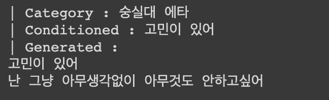
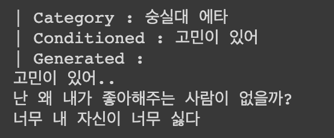
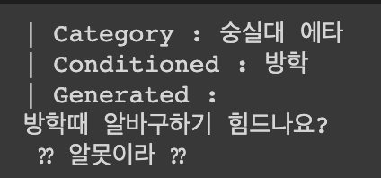
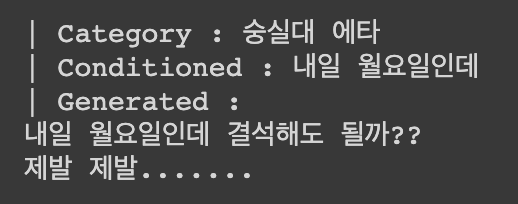
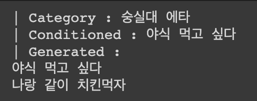
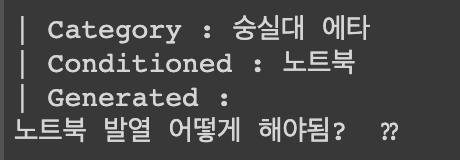
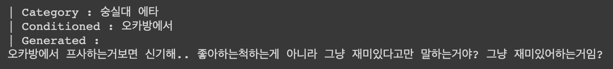
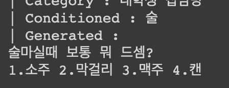

# UCK-GPT2 ( University Community KoGPT2 )

[](https://colab.research.google.com/drive/1p6DIxsesi3eJNPwFwvMw0MeM5LkSGoPW?usp=sharing)	[](https://github.com/jason9693/UCK-GPT2/issues)	

## 대학 커뮤니티 게시글 생성기

SKT-AI에서 공개한 [KoGPT2](https://github.com/SKT-AI/KoGPT2) 모델을 파인튜닝하여 대학 커뮤니티 게시글을 생성하는 모델입니다. 총 에브리타임, 캠퍼스픽 데이터 22만개를 이용해서 학습을 진행했으며, 학습에는 대략 **3일**정도 소요되었습니다.

* [GPT 논문 리뷰 링크](https://www.notion.so/Improve-Language-Understanding-by-Generative-Pre-Training-GPT-afb4b5ef6e984961ac022b700c152b6b)

## 모델 구성


### 스타일 컨트롤 토큰

1. \<everytime> : "숭실대 에브리타임 자유게시판" 스타일 토킅

2. \<bamboo> : "캠퍼스픽 대나무숲 게시판" 스타일 토큰

3. \<moyun> : "캠퍼스픽 모두를 위한 연애 게시판" 스타일 토큰


## 데이터 전처리

아래 표와 같이 데이터가 column에 **id**, **text** 가 포함된 `.csv` 파일을 탭 단위로 분리된 `${id}\t${text}` 형태로 저장된 `.txt` 파일로 변환해 주는 과정을 진행합니다.

실행은 `preprocess.ipynb` 파일을 colab으로 실행시키면 됩니다.

|   id | ...  | text                                                         |
| ---: | :--- | ------------------------------------------------------------ |
|    1 | ...  | 취향 자장면 평가 쏘스가 이렇게 꾸덕하고 물기없는 자장면은 첨봤음 참기름인것같은 맛... |
|    2 | ...  | (성공) 뜨면 F는 아닌거지? F일줄 알았는데..제발..             |
|    3 | ...  | 요즘 케리비안베이 사람 많나?                                 |
|    4 | ...  | 싸강 출석 싸강 오십분 오프라인 오십분으로 진행하는 강의가있는데여 온라인 결석 한번... |
|    5 | ...  | 컴퓨팅적사고 삽니다 이공계재수강 쪽지주세요 제발부탁드립니다.. |
|  ... | ...  | ...                                                          |
|    n | ...  | 미엌 미엌미엌미엌                                            |
|  n+1 | ...  | 컴퓨터학부 복필 다음학기 복수전공 예정자인데 컴퓨터학부 복필과목은 뭐가있나요...?... |
|  n+2 | ...  | 경상관 보통 몇시에 문 잠금?? 열시?                           |
|  n+3 | ...  | 야간대학이랑 주간대학이랑 학력 차이 없지?                    |
|  n+4 | ...  | 최우진 전력전자 족보 삼 있음?                                |

## 학습

 `preprocess.ipynb` 파일을 colab으로 실행시키면 됩니다.

## 생성(인퍼런스)

1. 자신이 학습한 모델로 생성하기 :  `inference.ipynb` 파일을 colab으로 실행시키면 됩니다.
2. [레포 소유자](https://github.com/jason9693) 가 학습한 모델로 생성하기 : 제목 아래에 있는  뱃지를 클릭해 주세요.

## Generated Samples






















## License

```
MIT License

Copyright (c) 2019 Kichang-Yang

Permission is hereby granted, free of charge, to any person obtaining a copy
of this software and associated documentation files (the "Software"), to deal
in the Software without restriction, including without limitation the rights
to use, copy, modify, merge, publish, distribute, sublicense, and/or sell
copies of the Software, and to permit persons to whom the Software is
furnished to do so, subject to the following conditions: ...
```

